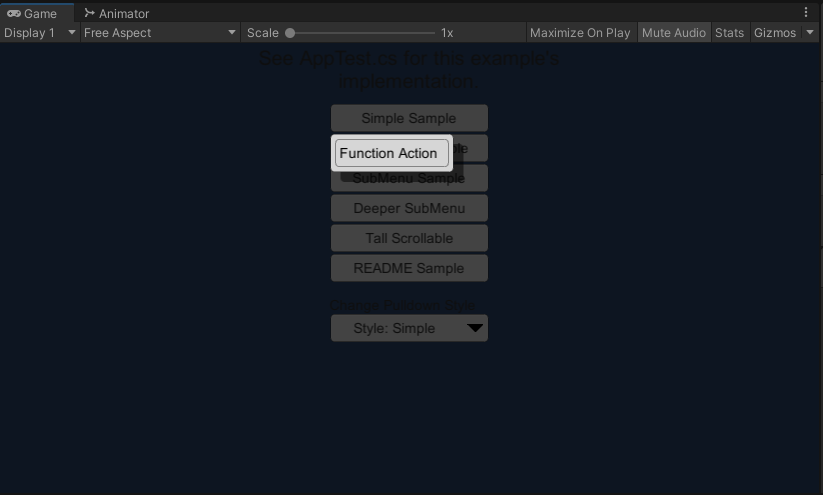
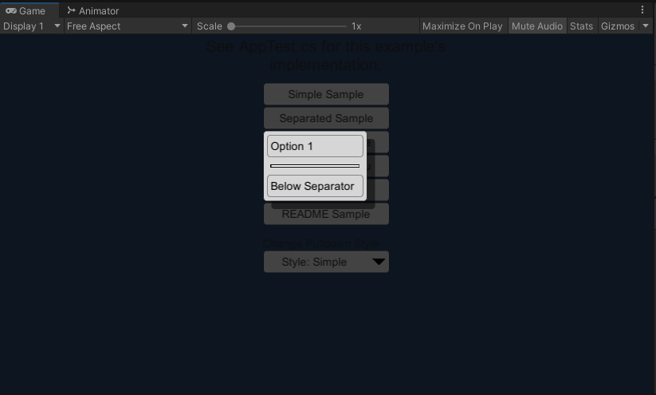
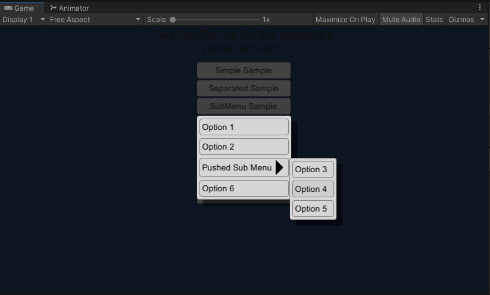
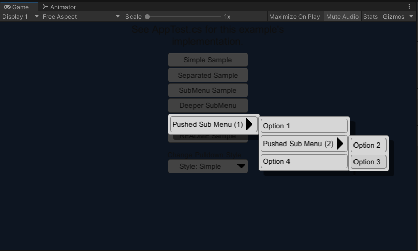
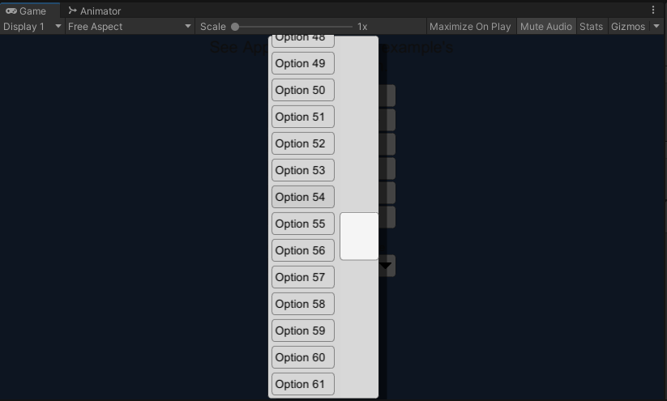
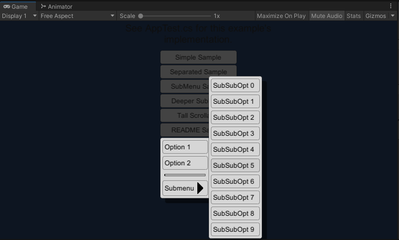
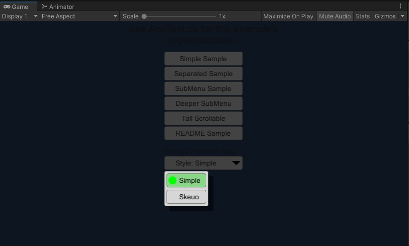

# PxPre DropMenu Management
This is a supporting project to the DropdownMenu_Core library,
https://github.com/Reavenk/DropdownMenu_Core

It is a UI library for the Unity game engine that represents dropdown menus, and procedurally creates them via the UGUI API on demand.

The Core library repository has the needed files to use the DropMenu functionality. But documentation, examples and test assets are deferred to this repository.

See the README in the Core library to check which version of Unity is expected.


# Directory Structure

```
|-- Repo_Root
   |-- AssetDevs
   |-- Assets
   |  |-- Refs
   |  |  |-- DropMenu
   |  |-- SampleStyles
   |  |  |-- Simple
   |  |  |-- Skeuo
   |  |-- Scenes
   |  |  |-- SampleScene.unity
   |  |-- Sprites
   |  |  | ... Misc asset files
   |  |-- AppTest.cs
   |
   | ... The rest of a typical Unity project 
```

* `AssetDevs` will have asset source files.
* `Assets/Refs` will contain any external references.
* `Assets/Refs/DropMenu` will contain the submodule to the Core library.
* `SampleStyles` will contain two different style property samples.		

* `Scenes/SampleScene.unity` will contain the example scene.

# How To Install

To use, add the [Core](https://github.com/Reavenk/DropdownMenu_Core/) library somewhere in the folder hierarchy of the `Assets/` folder for your Unity project.

# How To Use

The first few sections will describe some details and concepts about the library. Some instructions will be covered in the `Steps` sub-header.

## Properties

The Dropdown menu system doesn't use any prefabs. Instead it has visual and behavioral properties , `Props` defined in `Props.cs` that are derived from a `ScriptableObject`.

## Steps

#### Project and Scene Setup

There are a few ways to use the library, the instructions below are a specific example of how to use the library for creating pulldown menus around a `RectTransform`.

1. Ensure the library has been added to the Unity project.
2. Create a Prop by going to `Assets>Create>PxPre>DropMenuProps` in the Unity menu bar. This option should have been added by Editor scripts in the library. This will create a file that can be renamed and placed into the correct location of your project.
3. Assign the values of the newly create Prop using the inspector. For details on the different values, see the comments in `Props.cs`. If you wish to skip this step, consider using one of the premade Props in the `Assets/SampleStyles` folder of this repository.
4. To make a single Prop accessible to all your C# code, create a `GameObject` and assign to it the  `DropMenuSingleton` and `DropMenuSpawner` scripts.
5. For the newly added `DropMenuSpawner`, assign the `props` member with the `Props` file that was created.

5. Ensure there is a `Canvas` in the scene that your menu-invoking code has access to.

#### Invoking a Dropdown Menu In Code

For this example, we'll assume it's running in a callback for a pressed `UnityEngine.UI.Button` object, whose `RectTransform` will be named `rt`. We will also assume we have the reference to the UI `Canvas` the button belongs to - which will need to be the same `Canvas` that the `DropMenu` will be created in.

```C#
void OnButtonClick()
{ 
   // The button that was clicked, and to create a menu dropdown onto
   RectTransform rt = this.btn.GetComponent<RectTransform>();
```

Menus are represented by a hierarchy of menu nodes, but instead of creating those objects directly, a utility class called `StackUtil` with a small API (via its methods) can be used.

`AddAction()` can be used to create action buttons. It takes a `System.Action` for the action to execute if selected. Lambda functions and parameter-less functions can also be used. We'll skip over the definition of `OnMenu_Option2()` , because it's just an arbitrary function that gets called if the menu item is selected.

```C#
   PxPre.DropMenu.StackUtil menuStack = new PxPre.DropMenu.StackUtil("");

   menuStack.AddAction("Option 1", ()=>{ Debug.Log("Called Option 1");});
   menuStack.AddAction("Option 2", this.OnMenu_Option2 );
```

Separators can be added with a call to `AddSeparator()`.

```
   menuStack.AddSeparator();
```

Cascading submenus (aka, child menus) can be added by pushing a submenu context. This is done by calling `PushMenu()`. Any `Add*` calls afterwards will be added to this submenu, until `PopMenu()` is called to pop the submenu context being added to. Note you can have many layers of submenus.

```C#
   menuStack.PushMenu("Submenu");
      for(int i = 0; i < 10; ++i)
      {
         int iCpy = i; // The for loop iterator cannot be used directly.
         menuStack.AddAction($"SubSubOpt {iCpy}", ()=>{Debug.Log(iCpy.ToString());});
      }
   menuStack.PopMenu();
```

In the snippet above, note how we're procedurally add items. The DropMenu library excels at this (procedural and dynamic menu options). One important thing to note is that if you're going to have a loop with a lambda function, **NEVER** reference the loop iterator variable directly. You will have to make a copy and reference that - it's just a quirk of the C# language.

When you're done adding items to the DropMenu representation of the menu, it's time to use it to generate a UI. To do this, we're going to use the singletons we assigned earlier (in *Project and Scene Setup*).

```C#
   PxPre.DropMenu.DropMenuSingleton.MenuInst.CreateDropdownMenu(
      this.canvas,
      menuStack.Root,
      rt);
}
```

The value `this.canvas` is the `UnityEngine.Canvas` that the canvas that both the `RectTransform` of the button, and the created DropMenu will be created for.

The function does not take the `StackUtil` object we've been using, instead it takes the `PxPre.DropMenu.Node` which contains the node hierarchy that was being constructed with all the `Add*()` calls.

To put the whole sample together:

```C#
public void FunctionAction()
{	// I guess I'll include a definition for FunctionAction() 
	// in this combined sample.
	Debug.Log("Ran FunctionAction()");
}

void OnButtonClick()
{ 
	// The button that was clicked, and to create a menu dropdown onto
	RectTransform rt = this.btn.GetComponent<RectTransform>();
	PxPre.DropMenu.StackUtil menuStack = new PxPre.DropMenu.StackUtil("");

	menuStack.AddAction("Option 1", ()=>{ Debug.Log("Called Option 1");});
	menuStack.AddAction("Option 2", this.OnMenu_Option2 );
    
	menuStack.AddSeparator();
    
	menuStack.PushMenu("Submenu");
	for(int i = 0; i < 10; ++i)
	{
		int iCpy = i; // The for loop iterator cannot be used directly.
		menuStack.AddAction($"SubSubOpt {iCpy}", ()=>{Debug.Log(iCpy.ToString());});
	}
	menuStack.PopMenu();
    
	PxPre.DropMenu.DropMenuSingleton.MenuInst.CreateDropdownMenu(
        this.canvas,
        menuStack.Root,
        rt);
}
```

If you want to create a menu as a specific arbitrary point (instead of around a `RectTransform`) there is an overload of `PxPre.DropMenu.DropMenuSpawner.CreateDropdownMenu()` which can do that.

# Notes On The Sample Scene

The sample scene is a very simple setup. 

* It has a UI centered on the screen with a few buttons near the top, and a button styled as a pulldown at the bottom. 
* In the `Manager` `GameObject` there is a `DropMenuSingleton` and `DropMenuSpawner` object. 
* In the `Test` `GameObject` there is an `AppTest.cs` behaviour with references to some assets and UI elements.

The file `AppTest.cs` has all the main example code, as well as all the UI callbacks.

# SampleScene GUI Explanation

A description of the various UI elements:

* **Simple Sample**
  * The simplest example of creating a dropdown menu.
    
* **Separated Sample**
  * A simple example of using a separator to visually divide regions of the menu.
    

* **SubMenu Sample**
  * A simple example of creating a menu with a child submenu.
    

* **Deeper SubMenu**
  * A more complex example of submenus, where the submenu also has a submenu.
    
* **Tall Scrollable**
  * An example of the scrollbar feature. When a menu becomes really tall, a vertical scrollbar will be added.
    
* **README Sample**
  * The equivalent of the tutorial mentioned in this README above.
    
* **Change Pulldown Style**
  * A demo of changing styles. The button imitates a pulldown which allows changing the style property of the menu being created.
    
  * The sample comes with two styles:
    * Simple
      * Uses a lot of the Unity default assets for its sprites. Besides that it tries to be basic and reserved on the features it uses.
    * Skeuo
      * A slightly more ornate and embossed style. It also tries to use features that the Simple style didn't demonstrate. Note that this example style is supposed to be *different* from the Simple style, but ... not aesthetic.

# License

MIT License

Copyright (c) 2021 Pixel Precision, LLC

Permission is hereby granted, free of charge, to any person obtaining a copy of this software and associated documentation files (the "Software"), to deal in the Software without restriction, including without limitation the rights to use, copy, modify, merge, publish, distribute, sublicense, and/or sell copies of the Software, and to permit persons to whom the Software is furnished to do so, subject to the following conditions:

The above copyright notice and this permission notice shall be included in all copies or substantial portions of the Software.

THE SOFTWARE IS PROVIDED "AS IS", WITHOUT WARRANTY OF ANY KIND, EXPRESS OR IMPLIED, INCLUDING BUT NOT LIMITED TO THE WARRANTIES OF MERCHANTABILITY, FITNESS FOR A PARTICULAR PURPOSE AND NONINFRINGEMENT. IN NO EVENT SHALL THE AUTHORS OR COPYRIGHT HOLDERS BE LIABLE FOR ANY CLAIM, DAMAGES OR OTHER LIABILITY, WHETHER IN AN ACTION OF CONTRACT, TORT OR OTHERWISE, ARISING FROM, OUT OF OR IN CONNECTION WITH THE SOFTWARE OR THE USE OR OTHER DEALINGS IN THE SOFTWARE.


